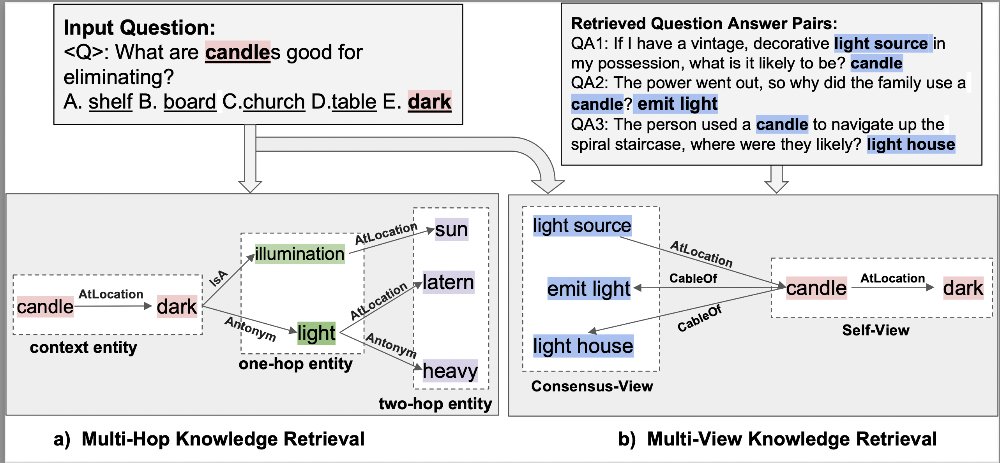

# MVP-Tuning
This is repo for paper: MVP-Tuning: Multi-View Knowledge Retrieval with Prompt Tuning for Commonsense Reasoning. Our paper is accpted in [ACL2023](https://aclanthology.org/2023.acl-long.750/). You can cite this paper as the following: 
```
@inproceedings{huang-etal-2023-mvp,
    title = "{MVP}-Tuning: Multi-View Knowledge Retrieval with Prompt Tuning for Commonsense Reasoning",
    author = "Huang, Yongfeng  and
      Li, Yanyang  and
      Xu, Yichong  and
      Zhang, Lin  and
      Gan, Ruyi  and
      Zhang, Jiaxing  and
      Wang, Liwei",
    booktitle = "Proceedings of the 61st Annual Meeting of the Association for Computational Linguistics (Volume 1: Long Papers)",
    month = jul,
    year = "2023",
    address = "Toronto, Canada",
    publisher = "Association for Computational Linguistics",
    url = "https://aclanthology.org/2023.acl-long.750",
    doi = "10.18653/v1/2023.acl-long.750",
    pages = "13417--13432",
    abstract = "Recent advances in pre-trained language models (PLMs) have facilitated the development ofcommonsense reasoning tasks. However, existing methods rely on multi-hop knowledgeretrieval and thus suffer low accuracy due toembedded noise in the acquired knowledge.In addition, these methods often attain highcomputational costs and nontrivial knowledgeloss because they encode the knowledge independently of the PLM, making it less relevant to the task and thus resulting in a poorlocal optimum. In this work, we propose MultiView Knowledge Retrieval with Prompt Tuning (MVP-Tuning). MVP-Tuning leveragessimilar question-answer pairs in the training setto improve knowledge retrieval and employsa single prompt-tuned PLM to model knowledge and input text jointly. We conduct our experiments on five commonsense reasoning QAbenchmarks to show that MVP-Tuning outperforms all other baselines in 4 out of 5 datasetswith less than 2{\%} trainable parameters. MVPTuning even gets a new state-of-the-art resulton OpenBookQA and is number one on theleaderboard.",
}
```

## How about MVP-Tuning?

### **New Knowledge Retrieval Paradigm: How to retrieve related knowledge from knowledge base?**

**Multi-View Knowledge Retrieval VS Multi-Hop Knowledge Retrieval**:
Intuitively, how to extract a partial knowledge graph, i.e., a subgraph, effectively and efficiently is crucial. Recent efforts focus on the multi-hop knowledge retrieval strategy, which anchors input context entities to KG nodes and obtains relevant subgraphs from these nodes and the corresponding multi-hop neighbors. Knowledge triplets retrieved by multi-hop retrieval need to be directly connected in the knowledge graph and form a path. This process is highly sensitive to the quality of the knowledge graph, e.g., it tends to fail when necessary triplets are distant from the query and even in another subgraph. Therefore, the knowledge extracted by this strategy is often incomplete and biased as the neighbors of the input context entities bound the search span.  
To this, we propose multi-view retrieval, which expands the pool of knowledge triplet candidates with additional highly-related question-answer pairs. This method does not suffer from the limitation of multi-hop retrieval and is able to connect distant or disjoint triplets via some similarity measurements, resulting in broader and more diverse triplets from the KG.

 

### **New Knoweledge Utilization Paradigm: How to harness retrieved knowledge?**

An intuitive way is to employ Graph Neural Networks (GNNs) to output node embeddings for KGs and then fuse them with embeddings of other input texts from PLMs. Despite being straightforward, this solution inherits critical issues from GNNs, such as over-smoothness. Instead, we explore a new way of encoding knowledge from KGs, simple yet effective. For encoding, we directly combine the retrieved knowledge triplets as texts and concatenate them with other textual information as the input of the PLM. Our approach can alleviate the computational cost and reduce the information loss compared to previous GNNs based approaches.

### **Parameter-Efficiency**

Our proposed multi-view knowledge retrieval scheme can outperform existing work regarding efficiency and accuracy by a large margin when built with recent successful parameter-efficient learning techniques, such as prompt-tuning with a PLM. 

## **How our MVP-Tuning Performs?**

We conduct our experiments on five commonsense reasoning QA benchmarks to show that MVP-Tuning outperforms all other baselines in 4 out of 5 datasets with only as most 2% trainable parameters. The ensemble of our MVP-Tuning models even gets a new state-of-the-art performance on OpenBookQA and is ranked first place on the [leaderboard](https://leaderboard.allenai.org/open_book_qa/submission/cdtvnvg4kc1nql1dnu3g)

## **How to run our MVP-Tuning.**

We provided one scripts for Openbook-QA dataset to run our MVP-Tuning. You just need to run the following scripts to reproduce our results
```
git clone https://github.com/kochsnow/MVP-Tuning.git

cd mvp_tuning

pip install -r requirement.txt

./run_obqa_aristo_roberta.sh

```


